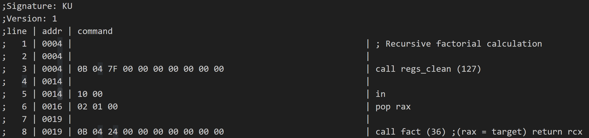
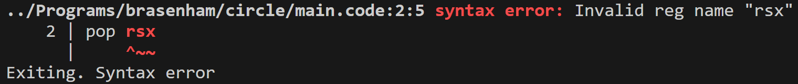
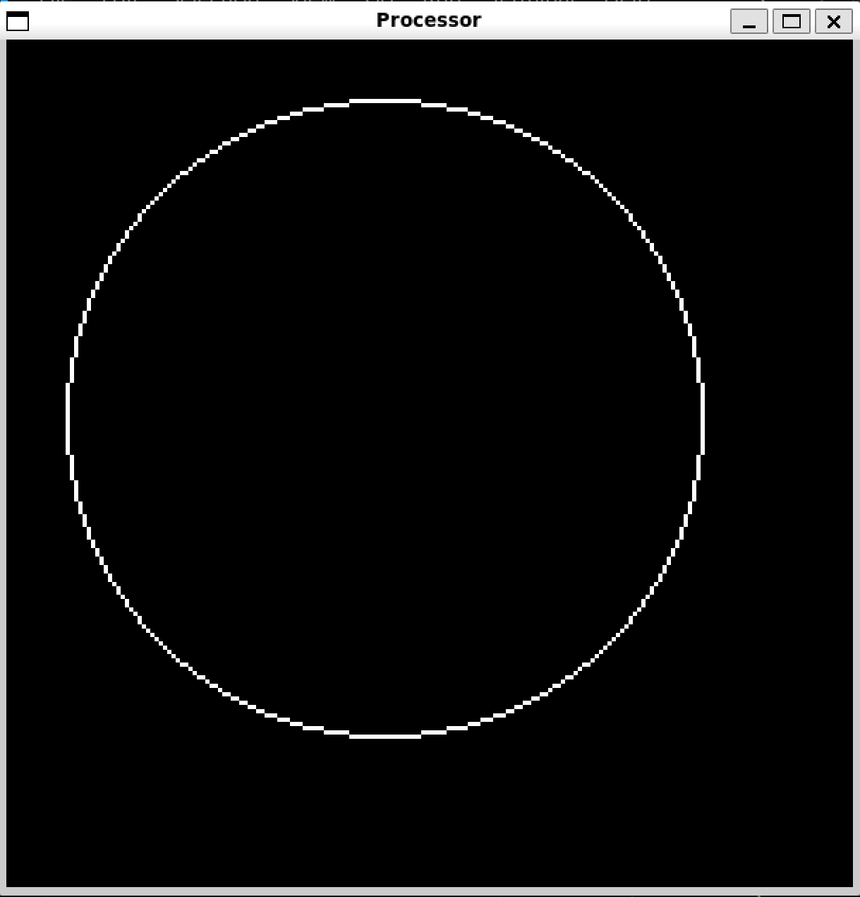
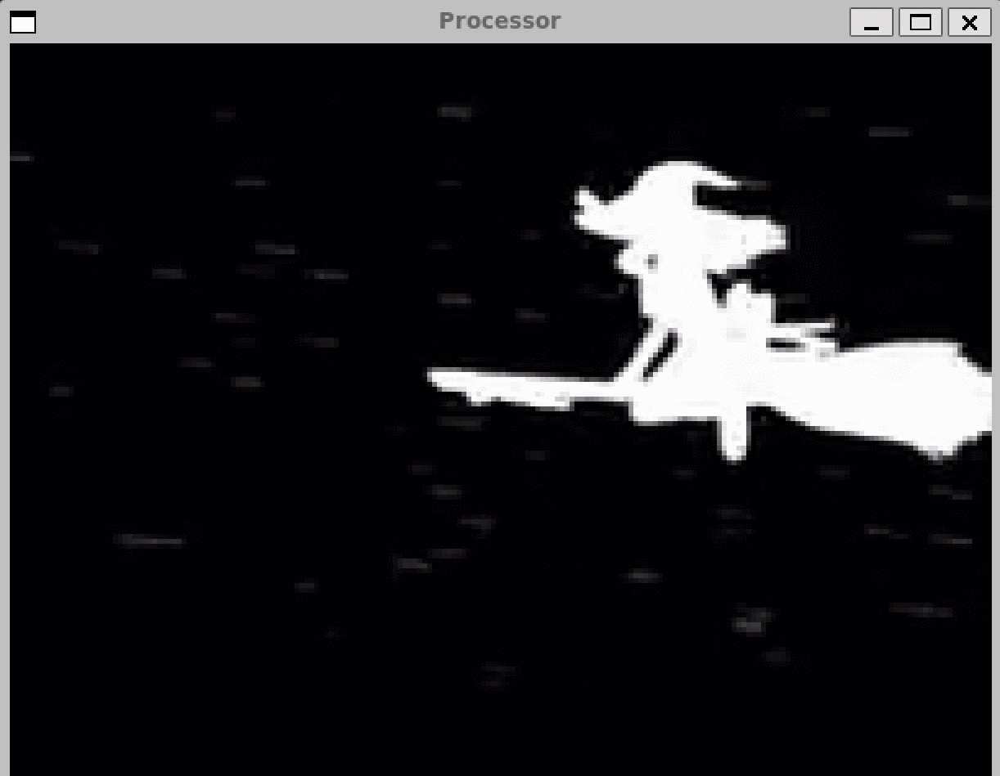

# Processor

Assembler, software processing unit (SPU), disassembler

## Main features
- Registers
- Stack
- RAM (can be visualised with video mode)

## Commands

### Features
- 25 commands
- 6 types of arguments
    - register
    - immutable double value
    - immutable int value
    - ram address
    - label (byte address in the executable file)
- code comments, are specified with `;`
- methods (`call` and `ret` commands)

### Syntax example
```
push rbx        ; push value from rbx register to stack
pop [rcx+1]     ; pop value from stack to RAM to address from register rcx + 1
jmp label       ; jump to label named "label"
```
### Commands list
#### Common info
- **stk** column means if function pushes or pops elements of stack

- **REG**, **DOUBLE**, **INT**, **RAM**, **LABEL** columns mean if function can recieve arguments of this type

- Registers names: `rax`, `rbx`, `rcx`, `rdx`, `rex`, `rfx`, `rgx`, `rhx`

#### Basic

|Name  |Opcode|stk|REG|DOUBLE|INT|RAM|LABEL|Description|
|:----:|:----:|:-:|:-:|:----:|:-:|:-:|:---:|:----------|
|`hlt` |   0  | - | - |   -  | - | - |  -  | halt - end of program
|`push`|   1  | +1| + |   +  | + | + |  +  | push value to stack
|`pop` |   2  | -1| + |   -  | + | + |  -  | pop value from stack
|`in`  |  16  | +1| - |   -  | - | - |  -  | console input (one number)
|`out` |  17  | -1| - |   -  | - | - |  -  | console output (one number)
|`dmp` |  31  | - | - |   -  | - | - |  -  | regs and stack dump

#### Jumps

You need to specify label in code. Then you can give it to jump function, and it will jump on this label. Also you can give register, then spu will jump to byte number, that is stored in register

E.g.
```
jmp foo
...
foo:
```
```
call func

func:
...
ret
```

|Name  |Opcode|stk|REG|DOUBLE|INT|RAM|LABEL|Description|
|:----:|:----:|:-:|:-:|:----:|:-:|:-:|:---:|:----------|
|`jmp` |   3  | - | + |   -  | - | - |  +  | jump to specified label (byte) of executable file
|`ja`* |   4  | -2| + |   -  | - | - |  +  | jump if `>`
|`jae`*|   5  | -2| + |   -  | - | - |  +  | jump if `>=`
|`jb`* |   6  | -2| + |   -  | - | - |  +  | jump if `<`
|`jbe`*|   7  | -2| + |   -  | - | - |  +  | jump if `<=`
|`je`* |   8  | -2| + |   -  | - | - |  +  | jump if `==`
|`jne`*|   9  | -2| + |   -  | - | - |  +  | jump if `!=`
|`jf`  |  10  | - | + |   -  | - | - |  +  | jump on Fridays
|`call`|  11  | +1| + |   -  | - | - |  +  | calls method (pushes to stack address of the next command for returning)
|`ret` |  12  | -1| - |   -  | - | - |  -  | pops return address from stack and jumps there (end of method)

`*` - this jumps are conditional. They pop 2 values from stack and compare them (values aren't returned). E.g. `ja` (>) will jump if last values in stack were `2`, `1` (2 > 1)

#### Maths

These functions pop 1 or 2 elements, make calculations and push result to stack

|Name  |Opcode|stk |REG|DOUBLE|INT|RAM|LABEL|Description|
|:----:|:----:|:--:|:-:|:----:|:-:|:-:|:---:|:----------|
|`add` |  18  |-2+1| - |   -  | - | - |  -  | `+` operator
|`sub` |  19  |-2+1| - |   -  | - | - |  -  | `-` operator
|`mul` |  20  |-2+1| - |   -  | - | - |  -  | `*` operator
|`div` |  21  |-2+1| - |   -  | - | - |  -  | `/` operator
|`sqrt`|  22  |-1+1| - |   -  | - | - |  -  | square root
|`sin` |  23  |-1+1| - |   -  | - | - |  -  | sinus
|`cos` |  24  |-1+1| - |   -  | - | - |  -  | cosinus
|`pow` |  25  |-2+1| - |   -  | - | - |  -  | power

#### Video mode

|Name  |Opcode|stk|REG|DOUBLE|INT|RAM|LABEL|Description|
|:----:|:----:|:-:|:-:|:----:|:-:|:-:|:---:|:----------|
|`shw` |  32  | - | - |   -  | - | - |  -  | renew video window (reads values from RAM)
|`fps` |  33  | - | - |   +  | - | - |  -  | set framerate limit for video mode

## Assembler

### Command line flags
- `-h`- prints help information and command list
- `-i` `<filename>` - specify input file name after this
- `-o` `<filename>` - specify output file name after this
- `-l` `<filename>` - enables and specifies listing file

### Features

- Assembles in 2 passes
- Optionally makes listing file with loads of useful information

    

- Throws gcc-like designed syntax errors:

    


## Software processing unit
### Command line flags
- `-h`- prints help information and command list
- `-i` `<filename>` - specify input file name after this

### Features
- Video mode
- Stack
- 8 Registers (`rax`, `rbx`, `rcx`, `rdx`, `rex`, `rfx`, `rgx`, `rhx`)
- RAM (acts as videomemory in video mode)

## Disassembler

### Command line flags
- `-h`- prints help information and command list
- `-i` `<filename>` - specify input file name after this
- `-o` `<filename>` - specify output file name after this
- `-d` - enables debug information

### Features
- In debug mode prints comments with byte address of each command

# Examples
You can find them in `Programs` directory

- **quad** - quad equations solver
- **recFact**, **iterFact** - recursive and iterative factorial calculation
- **circle** - draws circle in video mode (simple distance algorithm)
- **bresenham/line**, **bresenham/circle** - draws line and circle using bresenham algorithm (python and assembler realisations)
- **badApple**, **doom** - bad apple and doom gameplay videos (you can generate code for mp4 video with Programs/encoder.py script)





# Program features
- advanced text parsing in assembler (non null-terminated strings tokenisation)
- code generation
- goto dispatch table (spu)
- assembling in 2 passes. The first pass detects labels and size of output file, the second writes to file and listing
- `cmd_dict` - the only file for all information about commands
- DSL for commands actions
- video assembly code generator detects differnces and change only needed pixels. For example, badApple assemply code decreased by 3.5 times

# Usage

## Build
`make build` - build assembler, spu and disassembler

`make build_asm`, `make build_spu`, `make disasm` - build separately

## Run
`make assemble prog="name"` - only assemble `./Programs/"name"/main.code` (`lst=1` may be added for listing generation)

`make execute prog="name"` - execute `./Programs/"name"/main.exec`

`make disassemble prog="name"` - disassemble `./Programs/"name"/main.exec`

`make run prog="name"` - assemble and execute program `./Programs/"name"/main.code` (`lst=1` may be added for listing generation)

## Video encoding

`make encode prog="name"` - convert mp4 video to text program. Video must be here: `./Programs/"name"/"name".mp4`. Advanced settings are in `./Programs/encoder.py`.

## Docs
`make dox` or `make doxygen` - generate docs

# Credits
- [Ilya Dedinsky](https://github.com/ded32) aka Ded as prepod
- [Aleksei Durnov](https://github.com/Panterrich) as mentor
- MIPT as university
